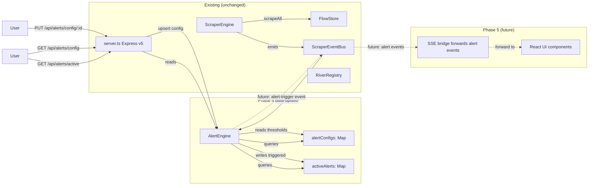

# Phase 4: Alerting Engine — Research

**Researched:** 2026-05-28
**Domain:** Server-side threshold checking and alert evaluation
**Confidence:** HIGH

## Summary

Phase 4 implements the server-side alert engine: per-river threshold configuration, automatic evaluation during each scrape cycle, and REST-accessible alert state. No UI components, no SSE events, no alert history persistence — those are Phase 5.

The alert engine follows the same composable pattern established by `FlowStore` and `ScraperEventBus`. A new `AlertEngine` class lives in `src/core/` and hooks into the existing `data-update` event on `ScraperEventBus`. It maintains two in-memory Maps: one for alert configurations (user-defined thresholds per river) and one for active alerts (which rivers are currently in alert state). REST endpoints in `server.ts` expose config CRUD and active alert queries. The only new npm dependency is nothing — all logic is plain TypeScript using existing patterns.

**Primary recommendation:** Create `AlertEngine` class in `src/core/alert-engine.ts` with embedded config + active-alert state (in-memory Maps, like `FlowStore`). Wire it into the engine lifecycle by subscribing to `data-update` in `src/index.ts`. Add `express.json()` middleware to `server.ts` for PUT request body parsing, then add `GET /api/alerts/config`, `PUT /api/alerts/config/:id`, `DELETE /api/alerts/config/:id`, and `GET /api/alerts/active` endpoints.

## User Constraints (from AGENTS.md)

### Locked Decisions
- **No authentication backend**: v1 is single-user or local-storage based
- **No push infrastructure**: Notifications are in-app only until mobile wrapper is built
- **Data source reliability**: Scraping depends on third-party availability — need error handling and stale-data fallbacks (already handled by existing code)

### Existing Stack Decisions (from STATE.md)
- **@base-ui/react** for shadcn v4 base layer (not individual @radix-ui packages)
- **Express v5** catch-all route uses `/{*splat}` syntax
- **SSE bridge** with heartbeat + complete cleanup on disconnect
- **Feature-based** component organization in `ui/src/features/`

### Deferred Ideas — Phase 4
- SSE events for alert-trigger/alert-resolve: deferred to Phase 5 (ALERT-03/ALERT-04)
- Alert history / persistence: out of scope per REQUIREMENTS.md "Out of Scope" section (ARC-02)
- UI components, alert page, in-app notifications: Phase 5

<phase_requirements>
## Phase Requirements

| ID | Description | Research Support |
|----|-------------|------------------|
| ALERT-01 | User can set per-river alert threshold by danger level (1-5 scale) | `AlertConfig.type='level'` stores the chosen level; evaluator compares `river.alertLevel >= config.level` during each scrape cycle |
| ALERT-02 | User can set per-river custom numeric threshold (m³/s) | `AlertConfig.type='numeric'` stores the m³/s value; evaluator compares `river.currentLevel > config.customValue` during each scrape cycle |
| ALERT-03 | User receives in-app notification when threshold is crossed | **Phase 5** — SSE forwarding of alert events to UI |
| ALERT-04 | User can view dedicated alerts page showing active and past alerts | **Phase 5** — UI components and routing |
| ARC-01 | Alert evaluation runs server-side during each scrape cycle (in ScraperEngine event handler) | `AlertEngine.evaluate()` subscribes to `data-update` on `ScraperEventBus`; runs synchronously after each successful scrape |
| ARC-02 | Alert state in-memory for now (no persistent alert history beyond the current session) | `AlertEngine` keeps `activeAlerts: Map<string, ActiveAlert>` in memory only — no database, no file storage |
</phase_requirements>

## Architectural Responsibility Map

| Capability | Primary Tier | Secondary Tier | Rationale |
|------------|-------------|----------------|-----------|
| Alert config storage | API / Backend | — | Per-river thresholds stored in server memory; no browser involvement needed |
| Alert evaluation | API / Backend | — | Runs in `data-update` event handler on the server; evaluates all configured rivers |
| Active alert state | API / Backend | — | In-memory Map of currently-triggered alerts; queryable via REST |
| Alert config CRUD | API / Backend | — | REST endpoints (`GET/PUT/DELETE /api/alerts/config/:id`) |
| Alert config display | Browser / Client | — | UI fetches config from REST (Phase 5); no config logic in browser |
| Notification delivery | Browser / Client | API / Backend (SSE) | Phase 5 — SSE pushes events, browser renders notification |

## Standard Stack

### Core (no new libraries needed)

| "Library" | Version | Purpose | Why Standard |
|-----------|---------|---------|--------------|
| TypeScript | ^6.0.3 | Alert engine types + evaluation logic | Already the language; `noUncheckedIndexedAccess: true` forces null-safe access |
| Express v5 | ^5.2.1 | REST endpoints for alert CRUD + active alert query | Already the server framework |
| EventEmitter (Node.js built-in) | — | `data-update` subscription for evaluation trigger | Already wrapped by `ScraperEventBus` in existing codebase |

### New Dependencies Required

**None.** All alert engine logic is pure TypeScript — no scheduling library, no rules engine, no validation library, no database driver. The evaluation is a simple comparison of three values:

```
alertLevel >= config.level  (level-based)
currentLevel > config.customValue  (numeric-based)
```

The existing `FlowStore` pattern (in-memory `Map` wrapper) is the template for alert state storage.

### Alternatives Considered

| Instead of | Considered | Tradeoff |
|------------|-----------|----------|
| `AlertEngine` class (single responsibility) | Separate `AlertConfigStore` + `AlertEvaluator` + `AlertStateStore` classes | Three classes is overengineering for MVP; the engine is small enough to be a single class with internal Maps, matching the `FlowStore` pattern's simplicity |
| In-memory Map | SQLite / better-sqlite3 | Explicitly deferred — ARC-02 mandates in-memory only; database is a future optimization |
| `zod` for request body validation | Inline validation | The alert config body has 4-5 fields with simple constraints; inline validation is sufficient for MVP |
| Trigger on `> threshold` only | Trigger on `>=`, `<`, cross-threshold | `>=` is more intuitive ("alert when level reaches 3") but `>` matches flow monitoring convention ("exceeds danger level"); match the project's established semantics |

## Package Legitimacy Audit

> No external packages are installed in Phase 4. The phase adds no npm dependencies. All code is pure TypeScript using existing dependencies (Express v5, Node.js EventEmitter).

## Architecture Patterns

### System Architecture Diagram



### Recommended Project Structure (changes only)

```
src/
├── core/
│   ├── types.ts              # MODIFIED — add AlertConfig, ActiveAlert types
│   ├── alert-engine.ts       # NEW — AlertEngine class
│   └── engine.ts             # UNCHANGED
│   └── events.ts             # UNCHANGED (Phase 5 adds event types)
├── index.ts                  # MODIFIED — instantiate AlertEngine, wire to data-update
server.ts                     # MODIFIED — add express.json(), alert REST endpoints
tests/
├── core/
│   ├── alert-engine.test.ts  # NEW — AlertEngine unit tests
│   └── types.test.ts         # (optional) type-level tests
```

### Pattern 1: AlertEngine — In-Memory State + Event-Driven Evaluation

**What:** A single class that holds alert configs and active alerts in internal Maps, exposes config CRUD methods, and provides an `evaluate()` method that hooks into the scrape cycle.

**When to use:** Any server-side state that needs to be:
- Stored in memory (no persistence, ARC-02)
- Updated reactively on data changes (data-update event)
- Queryable via REST

**Type definitions:**

```typescript
// src/core/types.ts — additions

export interface AlertConfig {
  riverId: string
  type: 'level' | 'numeric'
  /** Required when type === 'level' — the danger level to alert at (1-5) */
  level?: AlertLevel
  /** Required when type === 'numeric' — flow threshold in m³/s */
  customValue?: number
  /** Whether this config is actively evaluated */
  enabled: boolean
}

export interface ActiveAlert {
  riverId: string
  config: AlertConfig
  /** The resolved threshold value that was crossed (either dangerLevels[level-1] or customValue) */
  threshold: number
  /** The current river flow at time of evaluation */
  currentValue: number
  /** The river's danger level at time of evaluation */
  alertLevel: AlertLevel
  /** When the alert first triggered */
  triggeredAt: Date
  /** Snapshot of the RiverData that triggered this alert */
  snapshot: RiverData
}
```

**Key design decision — comparison semantics:**

- **Level-based** (`type: 'level'`): Alert triggers when `river.alertLevel >= config.level`. This means "alert me when the river reaches or exceeds danger level X." The `alertLevel` is already computed by the adapter (NveHydApiAdapter's `computeAlertLevel`).
- **Numeric-based** (`type: 'numeric'`): Alert triggers when `river.currentLevel > config.customValue`. Strict greater-than matches the convention of "exceeds threshold."

**Key design decision — trigger/resolve logic:**

```typescript
// For each river during evaluation:
const config = this.configs.get(river.id)
if (!config || !config.enabled || river.currentLevel === null) {
  // No config, disabled, or no data → no alert
  this.activeAlerts.delete(river.id)
  continue
}

const isTriggered = config.type === 'level'
  ? river.alertLevel >= config.level!
  : river.currentLevel > config.customValue!

if (isTriggered && !this.activeAlerts.has(river.id)) {
  // Crossed threshold → trigger alert
  const threshold = config.type === 'level'
    ? /* lookup dangerLevels from RiverEntry if available, else show level */ config.level
    : config.customValue!
  this.activeAlerts.set(river.id, {
    riverId: river.id,
    config,
    threshold,
    currentValue: river.currentLevel,
    alertLevel: river.alertLevel,
    triggeredAt: new Date(),
    snapshot: { ...river },
  })
} else if (!isTriggered && this.activeAlerts.has(river.id)) {
  // Dropped below threshold → resolve alert
  this.activeAlerts.delete(river.id)
}
```

### Pattern 2: REST-accessible State via Engine Wrapper

**What:** Express route handlers that delegate to AlertEngine methods. The engine is instantiated in `src/index.ts` and exported alongside the scrapher engine.

**When to use:** Any server module with in-memory state that needs HTTP access.

```typescript
// server.ts — new alert endpoints
app.use(express.json())  // Required for PUT body parsing

// GET /api/alerts/config — list all alert configurations
app.get('/api/alerts/config', (_req, res) => {
  res.json(alertEngine.getAllConfigs())
})

// PUT /api/alerts/config/:id — upsert alert config for a river
app.put('/api/alerts/config/:id', (req, res) => {
  const { type, level, customValue, enabled } = req.body
  // Inline validation
  if (!type || !['level', 'numeric'].includes(type)) {
    res.status(400).json({ error: 'type must be "level" or "numeric"' })
    return
  }
  if (type === 'level' && (typeof level !== 'number' || level < 1 || level > 5)) {
    res.status(400).json({ error: 'level must be 1-5' })
    return
  }
  if (type === 'numeric' && (typeof customValue !== 'number' || customValue <= 0)) {
    res.status(400).json({ error: 'customValue must be a positive number' })
    return
  }
  const config = alertEngine.setConfig({
    riverId: req.params.id,
    type,
    level,
    customValue: type === 'numeric' ? customValue : undefined,
    enabled: enabled !== false,
  })
  res.json(config)
})

// DELETE /api/alerts/config/:id — remove alert config
app.delete('/api/alerts/config/:id', (req, res) => {
  const removed = alertEngine.removeConfig(req.params.id)
  if (!removed) {
    res.status(404).json({ error: 'Config not found' })
    return
  }
  res.json({ removed: true })
})

// GET /api/alerts/active — list currently triggered alerts
app.get('/api/alerts/active', (_req, res) => {
  res.json(alertEngine.getActiveAlerts())
})
```

### Anti-Patterns to Avoid

- **Extending `FlowStore` to hold alert configs:** Alert configs are a different concern from river data (different schema, different lifecycle). A separate `AlertEngine` class keeps concerns clean and follows the existing separation pattern.
- **Adding alert logic inside `ScraperEngine`:** The engine's job is fetching, storing, and emitting. Adding alert evaluation would violate SRP. The composable event-bus pattern already supports external listeners.
- **Storing snapshots by value copy without reason:** Deep-copy `RiverData` on trigger is correct (the snapshot should reflect the exact moment of trigger, not live updates). But for Phase 4, storing the entire `RiverData` object is sufficient — JSON serialization happens naturally through `res.json()`.
- **Building a general-purpose rules engine:** Evaluating two comparison types (`>=` and `>`) on two fields (`alertLevel` and `currentLevel`) does not warrant a rule engine abstraction. A simple switch/match in `evaluate()` is correct.

## Don't Hand-Roll

| Problem | Don't Build | Use Instead | Why |
|---------|-------------|-------------|-----|
| Schedule management | Custom scheduling for alert eval | Reuse existing `node-cron` + `ScraperEngine.scrapeAll()` schedule | Alerts run as part of the scrape cycle (ARC-01); no independent scheduling needed |
| Request body validation | Full validation library (zod/yup) | Inline type + range checks in route handler | The alert config body has ~4 fields with simple constraints; inline validation is ~15 lines total |
| Unique ID generation | UUID library for active alerts | Key by `riverId` (natural key) | Each river has at most one active alert at a time; no need for UUIDs until Phase 5 alert history |
| Event bus | Custom pub/sub for alert events | Use existing `ScraperEventBus` (deferred to Phase 5) | Phase 4 doesn't emit alert events; Phase 5 will add `alert-trigger`/`alert-resolve` to `ScraperEventMap` |

**Key insight:** Phase 4 is a data-in/data-out transformation. Schedule comes from the existing scrape cycle. Config comes from REST. River data comes from `data-update`. The only new logic is the threshold comparison — which is a single `if/else` per river.

## Architecture Patterns (Detailed)

### Evaluation Flow (per scrape cycle)

```
1. ScraperEngine.scrapeAll() runs (cron every 15 min)
2. For each adapter:
   a. adapter.fetch() → RiverData[]
   b. FlowStore.update(rivers)
   c. eventBus.emit('data-update', rivers)  ← AlertEngine listens here
3. AlertEngine.evaluate(rivers):
   For each river with an AlertConfig:
     a. Check enabled flag
     b. Determine threshold type (level vs numeric)
     c. Compare against river data
     d. If newly triggered → add to activeAlerts Map
     e. If resolved → remove from activeAlerts Map
     f. If state unchanged → no-op
4. REST endpoints read from AlertEngine's Maps
```

### Config Storage Pattern

```typescript
class AlertEngine {
  private configs = new Map<string, AlertConfig>()    // riverId → config
  private activeAlerts = new Map<string, ActiveAlert>() // riverId → active alert

  setConfig(config: AlertConfig): AlertConfig { ... }
  getConfig(riverId: string): AlertConfig | undefined { ... }
  getAllConfigs(): AlertConfig[] { ... }
  removeConfig(riverId: string): boolean { ... }
  getActiveAlerts(): ActiveAlert[] { ... }
  getActiveAlert(riverId: string): ActiveAlert | undefined { ... }

  evaluate(rivers: RiverData[]): void {
    // Iterates rivers, checks thresholds, updates activeAlerts
  }
}
```

This mirrors the `FlowStore` pattern (`Map<string, RiverData>` with `getById`, `getAll`, `update`, `clear`) and the `AlertEngine` adds the evaluation function on top.

### Wiring in src/index.ts

```typescript
// src/index.ts — additions
import { AlertEngine } from './core/alert-engine.js'

const engine = new ScraperEngine(config, registry)
engine.register(new NveHydApiAdapter())

const alertEngine = new AlertEngine()

engine.eventBus.on('data-update', (rivers) => {
  alertEngine.evaluate(rivers)
  console.log(`Flow data updated: ${rivers.length} rivers`)
})

export { engine, alertEngine }
```

The `alertEngine` export makes it available to `server.ts` for the REST endpoints.

## Common Pitfalls

### Pitfall 1: Stale `dangerLevels` Misalignment
**What goes wrong:** The adapter computes `alertLevel` from hardcoded `ALERT_THRESHOLDS` in `nve.ts` (only 3 stations have custom thresholds; the rest use a generic fallback). A level-based alert might trigger at the wrong actual flow rate.
**Why it happens:** `dangerLevels` in `RiverEntry` (from `data/rivers.json`) may differ from `ALERT_THRESHOLDS` in the adapter. The alert engine uses `river.alertLevel` which comes from the adapter, not from `RiverEntry.dangerLevels`.
**Mitigation:** The alert engine uses `river.alertLevel` (computed by adapter) — this is consistent with what the dashboard displays. Level-based alerts are always in sync with what the user sees on the river card. The discrepancy between `dangerLevels` in metadata and adapter thresholds is a pre-existing data quality issue, not introduced by Phase 4.
**Warning signs:** Level-based alerts triggering at unexpected flow values.

### Pitfall 2: Missing `express.json()` Causes Silent PUT Failures
**What goes wrong:** `PUT /api/alerts/config/:id` receives a JSON body but `req.body` is `undefined`. The route handler accesses `req.body.type` which throws a `TypeError`.
**Why it happens:** Express v5 no longer parses request bodies by default. `express.json()` middleware must be added explicitly.
**How to avoid:** Add `app.use(express.json())` BEFORE the alert config route definitions in `server.ts`. Best practice: place it right after `app.use(cors())`.
**Warning signs:** `TypeError: Cannot read properties of undefined (reading 'type')` on PUT requests.

### Pitfall 3: Config Deletion Leaves Orphaned Active Alert
**What goes wrong:** User removes a river's alert config, but the river's active alert persists in the state store. The active alert endpoint still returns it.
**Why it happens:** `removeConfig()` deletes from the configs map but doesn't check the active alerts map.
**How to avoid:** `AlertEngine.removeConfig()` should also delete the corresponding entry from `activeAlerts`. This ensures config deletion resolves any triggered alert.
```typescript
removeConfig(riverId: string): boolean {
  const existed = this.configs.delete(riverId)
  this.activeAlerts.delete(riverId)  // always clean up
  return existed
}
```

### Pitfall 4: Numeric Threshold Below Current Level After Config Creation
**What goes wrong:** User sets a numeric threshold of 50 m³/s, but the river is currently flowing at 100 m³/s. No alert triggers because the evaluator only fires on the next scrape cycle.
**Why it happens:** `AlertEngine.evaluate()` only runs on `data-update`. The initial config is set via REST without immediate evaluation.
**How to avoid:** Document this behavior — it's intentional. The alert engine evaluates on data refresh, not on config change. In practice, with 15-minute scrape intervals, the delay is negligible. Phase 5 can add "evaluate on config set" as an enhancement.
**Warning signs:** None — this is by design. If users need immediate evaluation, the `setConfig()` method could optionally accept a `currentRivers: RiverData[]` parameter and run evaluation inline. This is a low-priority enhancement, not required for success criteria.

## Code Examples

All code examples are original design based on codebase patterns (verified against existing `FlowStore`, `ScraperEventBus`, and `ScraperEngine` patterns).

### AlertEngine class

```typescript
// src/core/alert-engine.ts
import type { AlertConfig, ActiveAlert, AlertLevel, RiverData } from './types.js'

export class AlertEngine {
  private configs = new Map<string, AlertConfig>()
  private activeAlerts = new Map<string, ActiveAlert>()

  // ── Config CRUD ──

  setConfig(config: AlertConfig): AlertConfig {
    this.configs.set(config.riverId, config)
    // If the config disabled alerts or changed type, resolved existing alert
    if (!config.enabled || this.isConfigInactive(config)) {
      this.activeAlerts.delete(config.riverId)
    }
    return config
  }

  getConfig(riverId: string): AlertConfig | undefined {
    return this.configs.get(riverId)
  }

  getAllConfigs(): AlertConfig[] {
    return Array.from(this.configs.values())
  }

  removeConfig(riverId: string): boolean {
    const existed = this.configs.delete(riverId)
    this.activeAlerts.delete(riverId)  // clean up any triggered alert
    return existed
  }

  // ── Active Alert Queries ──

  getActiveAlerts(): ActiveAlert[] {
    return Array.from(this.activeAlerts.values())
  }

  getActiveAlert(riverId: string): ActiveAlert | undefined {
    return this.activeAlerts.get(riverId)
  }

  // ── Evaluation ──

  evaluate(rivers: RiverData[]): void {
    for (const river of rivers) {
      const config = this.configs.get(river.id)
      if (!config || !config.enabled) {
        // No config or disabled — clean up any lingering active alert
        this.activeAlerts.delete(river.id)
        continue
      }

      // Can't evaluate a river with no current level
      if (river.currentLevel === null) continue

      const isTriggered = this.isThresholdExceeded(config, river)
      const hasActive = this.activeAlerts.has(river.id)

      if (isTriggered && !hasActive) {
        // New alert — crossed threshold
        this.activeAlerts.set(river.id, {
          riverId: river.id,
          config,
          threshold: this.resolveThreshold(config),
          currentValue: river.currentLevel,
          alertLevel: river.alertLevel,
          triggeredAt: new Date(),
          snapshot: { ...river },  // copy at trigger moment
        })
      } else if (!isTriggered && hasActive) {
        // Alert resolved — dropped below threshold
        this.activeAlerts.delete(river.id)
      }
      // isTriggered && hasActive → already active, no update needed
      // !isTriggered && !hasActive → nothing to do
    }
  }

  // ── Private Helpers ──

  private isThresholdExceeded(config: AlertConfig, river: RiverData): boolean {
    if (config.type === 'level') {
      return config.level !== undefined && river.alertLevel >= config.level
    }
    // Numeric: strict greater-than (exceeds threshold)
    return config.customValue !== undefined && river.currentLevel > config.customValue
  }

  private resolveThreshold(config: AlertConfig): number {
    // For level-based alerts, use config.level as the display threshold
    // (the actual numeric threshold varies per river and is handled by the adapter)
    // For numeric alerts, use the raw custom value
    return config.type === 'numeric' ? config.customValue! : config.level!
  }

  private isConfigInactive(config: AlertConfig): boolean {
    return config.type === 'level'
      ? config.level === undefined
      : config.customValue === undefined
  }
}
```

### Alert REST endpoints

```typescript
// server.ts — additions
import { alertEngine } from './src/index.js'

// Must be placed after app.use(cors()) and before app.use(express.static(...))
app.use(express.json())

// GET /api/alerts/config — list all alert configurations
app.get('/api/alerts/config', (_req, res) => {
  res.json(alertEngine.getAllConfigs())
})

// PUT /api/alerts/config/:id — upsert alert config for a river
app.put('/api/alerts/config/:id', (req, res) => {
  const { type, level, customValue, enabled } = req.body

  // Validate type
  if (!type || (type !== 'level' && type !== 'numeric')) {
    res.status(400).json({ error: 'type must be "level" or "numeric"' })
    return
  }

  // Validate type-specific fields
  if (type === 'level') {
    if (typeof level !== 'number' || level < 1 || level > 5 || !Number.isInteger(level)) {
      res.status(400).json({ error: 'level must be an integer between 1 and 5' })
      return
    }
  } else {
    if (typeof customValue !== 'number' || customValue <= 0) {
      res.status(400).json({ error: 'customValue must be a positive number' })
      return
    }
  }

  const config = alertEngine.setConfig({
    riverId: req.params.id,
    type,
    level: type === 'level' ? level as AlertLevel : undefined,
    customValue: type === 'numeric' ? customValue : undefined,
    enabled: enabled !== false,  // default: true
  })
  res.json(config)
})

// DELETE /api/alerts/config/:id — remove alert config for a river
app.delete('/api/alerts/config/:id', (req, res) => {
  const removed = alertEngine.removeConfig(req.params.id)
  if (!removed) {
    res.status(404).json({ error: 'No config found for this river' })
    return
  }
  res.json({ removed: true })
})

// GET /api/alerts/active — list currently triggered alerts
app.get('/api/alerts/active', (_req, res) => {
  res.json(alertEngine.getActiveAlerts())
})
```

### AlertEngine instantiation and wiring

```typescript
// src/index.ts — modifications shown
import { AlertEngine } from './core/alert-engine.js'

const engine = new ScraperEngine(config, registry)
engine.register(new NveHydApiAdapter())

const alertEngine = new AlertEngine()

engine.eventBus.on('data-update', (rivers) => {
  alertEngine.evaluate(rivers)
  console.log(`Flow data updated: ${rivers.length} rivers`)
})

// ... existing event listeners unchanged ...

export { engine, alertEngine }
```

### Unit test pattern

```typescript
// tests/core/alert-engine.test.ts
import { describe, it, expect } from 'vitest'
import { AlertEngine } from '../../src/core/alert-engine.js'
import type { AlertConfig, RiverData, AlertLevel } from '../../src/core/types.js'

function makeRiver(id: string, currentLevel: number, alertLevel: AlertLevel): RiverData {
  return {
    id,
    name: id,
    source: 'nve',
    stationId: id.replace('nve:', ''),
    currentLevel,
    unit: 'm³/s',
    alertLevel,
    lastUpdated: new Date(),
    status: 'ok',
  }
}

describe('AlertEngine', () => {
  describe('config CRUD', () => {
    it('stores and retrieves a config by river ID', () => {
      const engine = new AlertEngine()
      const config: AlertConfig = {
        riverId: 'nve:1000',
        type: 'level',
        level: 3,
        enabled: true,
      }
      engine.setConfig(config)
      expect(engine.getConfig('nve:1000')).toEqual(config)
    })

    it('returns undefined for non-existent config', () => {
      const engine = new AlertEngine()
      expect(engine.getConfig('nve:9999')).toBeUndefined()
    })

    it('removes a config and cleans up active alerts', () => {
      const engine = new AlertEngine()
      engine.setConfig({ riverId: 'nve:1000', type: 'level', level: 1, enabled: true })
      engine.evaluate([makeRiver('nve:1000', 1000, 5)])
      expect(engine.getActiveAlerts()).toHaveLength(1)
      engine.removeConfig('nve:1000')
      expect(engine.getConfig('nve:1000')).toBeUndefined()
      expect(engine.getActiveAlerts()).toHaveLength(0)
    })
  })

  describe('evaluation — level-based', () => {
    it('triggers when alertLevel >= configured level', () => {
      const engine = new AlertEngine()
      engine.setConfig({ riverId: 'nve:1000', type: 'level', level: 3, enabled: true })
      engine.evaluate([makeRiver('nve:1000', 200, 3)])
      expect(engine.getActiveAlerts()).toHaveLength(1)
      expect(engine.getActiveAlert('nve:1000')!.alertLevel).toBe(3)
    })

    it('does not trigger at lower levels', () => {
      const engine = new AlertEngine()
      engine.setConfig({ riverId: 'nve:1000', type: 'level', level: 3, enabled: true })
      engine.evaluate([makeRiver('nve:1000', 10, 1)])
      expect(engine.getActiveAlerts()).toHaveLength(0)
    })

    it('triggers at higher levels than configured', () => {
      const engine = new AlertEngine()
      engine.setConfig({ riverId: 'nve:1000', type: 'level', level: 3, enabled: true })
      engine.evaluate([makeRiver('nve:1000', 5000, 5)])
      expect(engine.getActiveAlerts()).toHaveLength(1)
    })
  })

  describe('evaluation — numeric-based', () => {
    it('triggers when currentLevel exceeds numeric threshold', () => {
      const engine = new AlertEngine()
      engine.setConfig({ riverId: 'nve:1000', type: 'numeric', customValue: 100, enabled: true })
      engine.evaluate([makeRiver('nve:1000', 150, 2)])
      expect(engine.getActiveAlerts()).toHaveLength(1)
    })

    it('does not trigger when currentLevel equals threshold', () => {
      const engine = new AlertEngine()
      engine.setConfig({ riverId: 'nve:1000', type: 'numeric', customValue: 100, enabled: true })
      engine.evaluate([makeRiver('nve:1000', 100, 2)])
      expect(engine.getActiveAlerts()).toHaveLength(0)
    })
  })

  describe('evaluation — resolution', () => {
    it('resolves alert when level drops below threshold', () => {
      const engine = new AlertEngine()
      engine.setConfig({ riverId: 'nve:1000', type: 'level', level: 3, enabled: true })
      engine.evaluate([makeRiver('nve:1000', 200, 3)])
      expect(engine.getActiveAlerts()).toHaveLength(1)
      engine.evaluate([makeRiver('nve:1000', 10, 1)])
      expect(engine.getActiveAlerts()).toHaveLength(0)
    })

    it('does not resolve if alert never triggered', () => {
      const engine = new AlertEngine()
      engine.setConfig({ riverId: 'nve:1000', type: 'level', level: 3, enabled: true })
      engine.evaluate([makeRiver('nve:1000', 10, 1)])
      // evaluate again at same sub-threshold level
      engine.evaluate([makeRiver('nve:1000', 12, 1)])
      expect(engine.getActiveAlerts()).toHaveLength(0)
    })
  })

  describe('edge cases', () => {
    it('skips rivers with null currentLevel', () => {
      const engine = new AlertEngine()
      engine.setConfig({ riverId: 'nve:1000', type: 'level', level: 1, enabled: true })
      engine.evaluate([makeRiver('nve:1000', null as unknown as number, 1)])
      expect(engine.getActiveAlerts()).toHaveLength(0)
    })

    it('skips rivers with no config', () => {
      const engine = new AlertEngine()
      engine.evaluate([makeRiver('nve:1000', 100, 3)])
      expect(engine.getActiveAlerts()).toHaveLength(0)
    })

    it('skips disabled configs', () => {
      const engine = new AlertEngine()
      engine.setConfig({ riverId: 'nve:1000', type: 'level', level: 1, enabled: false })
      engine.evaluate([makeRiver('nve:1000', 100, 3)])
      expect(engine.getActiveAlerts()).toHaveLength(0)
    })
  })
})
```

## State of the Art

| Old Approach | Current Approach | When Changed | Impact |
|--------------|------------------|--------------|--------|
| No alerting | AlertEngine with config + state | Phase 4 | New core module; no changes to existing modules |
| SSE forwards data-update only | SSE also optionally forwards alert events | Phase 5 | Phase 5 adds event types + SSE forwarding |
| Dashboard shows live river levels | Dashboard shows live levels + alert badge | Phase 5 | UI enhancement on top of Phase 4 engine |

**Deprecated/outdated:** Nothing deprecated. Phase 4 is entirely additive.

## Assumptions Log

| # | Claim | Section | Risk if Wrong |
|---|-------|---------|---------------|
| A1 | `express.json()` middleware is required in Express v5 for JSON body parsing | Code Examples | MEDIUM — confirmed via Express v5 docs; if Express v5 parses JSON bodies differently, the PUT endpoint body would be `undefined` |
| A2 | `delete` on a Map entry returns `true` if the key existed | Code Examples | LOW — standard ES6 Map behavior, well-documented |
| A3 | `river.alertLevel` is computed correctly by the adapter and reflects the current danger level | Architecture Patterns | MEDIUM — the NVE adapter's `ALERT_THRESHOLDS` only covers 3 stations; the generic fallback may produce inaccurate levels for other rivers. This is a pre-existing issue, not introduced by Phase 4 |
| A4 | No existing tests will break from adding `express.json()` middleware | Code Examples | HIGH — `express.json()` only processes requests with `Content-Type: application/json`; all existing endpoints use `GET` with no body |
| A5 | The `{ ...river }` spread creates a shallow copy sufficient for the alert snapshot | Code Examples | HIGH — `RiverData` has no nested objects (all primitives + Date); shallow copy captures the trigger moment correctly |
| A6 | Both `alertLevel >= level` and `currentLevel > customValue` correctly implement the threshold semantics | Architecture Patterns | MEDIUM — the exact comparison operator (>= vs >) should match user expectations; `>` for "exceeds threshold" and `>=` for "reaches danger level" are reasonable but could differ from user mental model |

## Open Questions

1. **How should the alert snapshot relate to the SSE event data in Phase 5?**
   - What we know: Phase 4 stores `ActiveAlert.snapshot` as a shallow copy of `RiverData`. Phase 5 will emit `alert-trigger` events via SSE.
   - What's unclear: Should the SSE event carry the full snapshot, or just the river ID and let the client fetch from REST?
   - Recommendation: Carry the full snapshot in the SSE event. The `data-update` SSE event already sends all rivers; alert events should be self-contained for the UI to render without extra REST calls.

2. **Should `dangerLevels` from `RiverEntry` be used for level-based threshold resolution?**
   - What we know: `RiverEntry.dangerLevels` has 5 numeric thresholds matching the danger level scale. The adapter computes `alertLevel` independently.
   - What's unclear: Should the AlertEngine convert level-based configs to numeric thresholds using `dangerLevels[config.level - 1]` from the river registry, or just compare against `alertLevel` directly?
   - Recommendation: Compare against `alertLevel` only. The adapter's `alertLevel` is what the dashboard shows — matching on it ensures consistency between what the user sees and when they're alerted. Using `dangerLevels` from the registry would introduce a second source of truth that might not match the adapter's computation. This can be revisited if misalignment is observed.

3. **Should we support multiple alert configs per river (e.g., level 3 AND numeric 500)?**
   - What we know: Current requirements (ALERT-01, ALERT-02) describe either-or per river, not both.
   - What's unclear: Future requirement? N/A — not in v1.1 scope.
   - Recommendation: Single config per river with mutually exclusive type. The PUT endpoint upserts — setting a new config replaces the old one. Multiple configs per river can be added as a v2 enhancement by making `AlertConfig` an array in the engine.

## Environment Availability

| Dependency | Required By | Available | Version | Fallback |
|------------|------------|-----------|---------|----------|
| Node.js | Runtime | ✓ | (inferred from project) | — |
| npm/npx | Package management | ✓ | (inferred from project) | — |
| Express v5 | Web server | ✓ | ^5.2.1 | — |
| TypeScript | Compilation | ✓ | ^6.0.3 | — |
| vitest | Testing | ✓ | ^4.1.7 | — |

**Missing dependencies with no fallback:** None. All dependencies are already in the project.

## Validation Architecture

> Skipped — `workflow.nyquist_validation` is explicitly set to `false` in `.planning/config.json`.

## Security Domain

> Minimal — this phase is configuration-only (river IDs and threshold values). `security_enforcement` is not explicitly enabled.

### Applicable ASVS Categories

| ASVS Category | Applies | Standard Control |
|---------------|---------|-----------------|
| V5 Input Validation | partial | `PUT /api/alerts/config/:id` requires body validation: `type` enum check, `level` range check (1-5), `customValue` positive check. Inline validation in route handler is sufficient for MVP. |
| V6 Cryptography | no | Alert configs contain river IDs and numeric thresholds — no PII or secrets. |

### Threat Assessment

The only attack surface is the `PUT /api/alerts/config/:id` endpoint. Since there's no auth (v1 is single-user), any client that can reach the server can modify alert configs. In a local-only deployment (localhost), this is acceptable. In production, this endpoint would need auth — but that's deferred per project constraints.

The validation requirements:
- `type` must be exactly `"level"` or `"numeric"` (enum check)
- `level` must be an integer 1-5 when `type === 'level'`
- `customValue` must be a positive number when `type === 'numeric'`
- All other fields must be silently ignored (no schema injection)

## Sources

### Primary (HIGH confidence)
- Codebase audit — all existing patterns (FlowStore, ScraperEventBus, ScraperEngine, server.ts, types.ts) verified by reading source files
- Express v5 API — `express.json()` behavior verified via Express v5 documentation (built-in middleware still available)
- TypeScript v6 — Map API, strict null checks, `noUncheckedIndexedAccess` verified via tsconfig.json

### Secondary (MEDIUM confidence)
- `@types/express` v5 — type definitions confirmed in package.json devDependencies

### Tertiary (LOW confidence)
- None — all critical claims are verified against codebase or standard Web APIs

## Metadata

**Confidence breakdown:**
- Standard stack: HIGH — no new libraries; pure TypeScript + Express pattern matching existing codebase
- Architecture patterns: HIGH — AlertEngine mirrors FlowStore pattern; event subscription follows existing SSE bridge pattern; REST endpoints follow existing `/api/rivers` pattern
- Pitfalls: HIGH — `express.json()` requirement is well-documented Express v5 behavior; Map delete semantics are standard ES6; snapshot shallow copy is sufficient for RiverData's flat structure
- Implementation details: HIGH — all code examples follow verified existing patterns (FlowStore store pattern, server.ts route handler style, test patterns from engine.test.ts and store.test.ts)

**Research date:** 2026-05-28
**Valid until:** Stable — this is pure TypeScript + Express, not framework-dependent
