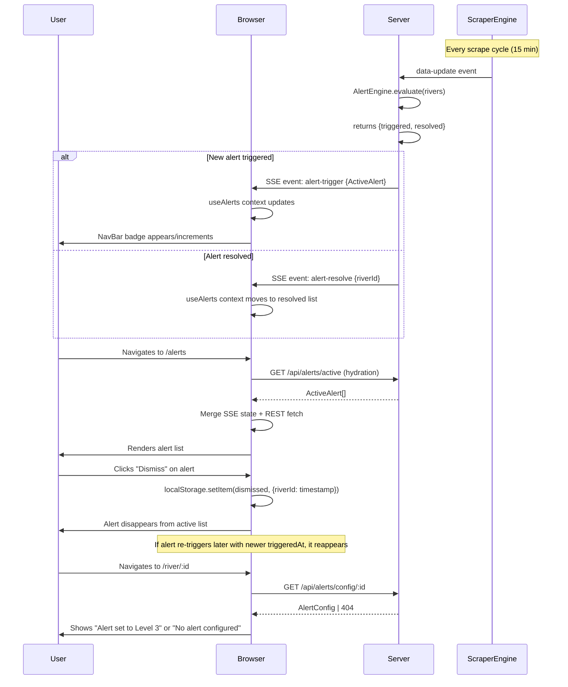

# Phase 5: Alerts Page + UX — Research

**Researched:** 2026-05-28
**Domain:** Client-side alert notification surface (SSE-driven React UI with localStorage-backed dismissal)
**Confidence:** HIGH

## Summary

Phase 5 surfaces the Phase 4 AlertEngine's active alerts in the browser, delivering on ALERT-03 and ALERT-04. This is primarily a client-side phase — a dedicated alerts page, a real-time alert count badge in navigation, dismissal tracking, and alert-config display on the river detail page. The server-side changes are minimal: adding two new event types (`alert-trigger`, `alert-resolve`) to the existing event bus and SSE bridge, modifying `AlertEngine.evaluate()` to return a diff of triggered/resolved alerts, and adding one new REST endpoint (`GET /api/alerts/config/:id`).

The UI follows established patterns: feature-based directories (`ui/src/features/alerts/`), SSE-driven hooks (`useAlerts` via React Context), localStorage-backed dismissal (mirroring the `useFavorites` persistence pattern), and the existing component library (lucide-react icons, shadcn-based UI primitives). No new npm packages are required.

**Primary recommendation:** Add `alert-trigger`/`alert-resolve` to `ScraperEventBus`; modify `AlertEngine.evaluate()` to return `{ triggered, resolved }`; wire event emission in `src/index.ts`; forward through SSE bridge; build `useAlerts` context + hook, `AlertsPage`, `AlertCard`, NavBar badge; update `RiverDetailPage`; add `/alerts` route.

<user_constraints>
## User Constraints (from AGENTS.md)

### Locked Decisions
- **No authentication backend**: v1 is single-user or local-storage based
- **No push infrastructure**: Notifications are in-app only until mobile wrapper is built
- **Data source reliability**: Scraping depends on third-party availability — need error handling and stale-data fallbacks (already handled by existing code)
- **Alert state in-memory only for v1.1**: ARC-02 — no persistent alert history beyond the current session
- **No persistent alert history**: Deferred per REQUIREMENTS.md "Out of Scope"

### Existing Stack Decisions (from STATE.md)
- **@base-ui/react** for shadcn v4 base layer (not individual @radix-ui packages)
- **Express v5** catch-all route uses `/{*splat}` syntax
- **SSE bridge** with heartbeat + complete cleanup on disconnect
- **Feature-based** component organization in `ui/src/features/`
- **Inline validation** for request bodies (no zod/yup)

### the agent's Discretion
- Alert dismissal semantics: client-side only (localStorage) vs. server-side acknowledgment
- Alert count badge style and position in NavBar
- `evaluate()` return type change (diff object vs. callbacks on AlertEngine)
- Whether to run immediate evaluation when a config is set via PUT
- Context provider vs. lifted state for sharing alert count across NavBar and AlertsPage

### Deferred Ideas (OUT OF SCOPE)
- SSE events for alert-trigger/alert-resolve: Phase 5 IS the phase that adds these (previously deferred from Phase 4)
- Push notifications: requires service worker push infra — NOT in Phase 5
- Persistent alert history: out of scope per ARC-02
- Email/SMS alerts: out of scope
- Alert sound/vibration: visual indicator only
</user_constraints>

<phase_requirements>
## Phase Requirements

| ID | Description | Research Support |
|----|-------------|------------------|
| ALERT-03 | User receives in-app notification when a river crosses its configured threshold | SSE `alert-trigger` event forwarded to browser → `useAlerts` context updates → NavBar badge count updates in real-time; badge serves as the in-app notification surface |
| ALERT-04 | User can view dedicated alerts page showing active and past alerts with timestamps | `/alerts` route → `AlertsPage` component renders all active (undismissed) `ActiveAlert` objects with river name, level, value, and `triggeredAt` timestamp; "past alerts" means previously-triggered-but-resolved alerts are shown in a separate list using the SSE `alert-resolve` event log accumulated during the session |
</phase_requirements>

## Architectural Responsibility Map

| Capability | Primary Tier | Secondary Tier | Rationale |
|------------|-------------|----------------|-----------|
| Alert event emission | API / Backend | — | `AlertEngine.evaluate()` detects state transitions and produces diff; `src/index.ts` emits on `ScraperEventBus` |
| Alert event forwarding | API / Backend | — | SSE bridge in `server.ts` forwards `alert-trigger`/`alert-resolve` to connected clients |
| Active alert state | API / Backend | — | In-memory `Map<string, ActiveAlert>` on server (Phase 4); client fetches via REST + SSE pushes |
| Alert count badge | Browser / Client | — | Rendered in NavBar, driven by `useAlerts` context (SSE subscription) |
| Alert dismissal | Browser / Client | — | Client-side only via localStorage; server is not informed |
| Alert config display | Browser / Client | API / Backend (REST) | RiverDetailPage fetches alert config via `GET /api/alerts/config/:id` |
| Alert history (session) | Browser / Client | — | Accumulated from SSE events during page session; not persisted across sessions per ARC-02 |

## Standard Stack

### Core (no new libraries needed)

| "Library" | Version | Purpose | Why Standard |
|-----------|---------|---------|--------------|
| TypeScript | ^6.0.3 | Alert types + React hooks + components | Already the language |
| React 19 | ^19.2.6 | Hooks/context for `useAlerts` | Already the UI framework |
| React Router | ^7.15.1 | `/alerts` route, NavBar `<Link>` | Already the router |
| Express v5 | ^5.2.1 | New GET /api/alerts/config/:id endpoint | Already the server |
| EventEmitter (Node.js) | — | New event types on ScraperEventBus | Already wrapped by existing code |
| vite-plugin-pwa | ^1.3.0 | Service worker compatibility for alert state | Already used for PWA support |

### New Dependencies Required

**None.** All Phase 5 work uses existing dependencies:
- React 19's `useContext` + `createContext` for alert state sharing
- `localStorage` for dismissal persistence (same pattern as `useFavorites`)
- React Router for `/alerts` route and NavLink
- lucide-react icons (`Bell`, `BellRing`, `X`, `AlertTriangle`, `Check`, `ArrowLeft`) for alert UI
- Existing shadcn `Badge` component for NavBar alert count
- Existing `Button` component for dismiss actions

### Alternatives Considered

| Instead of | Considered | Tradeoff |
|------------|-----------|----------|
| `evaluate()` returns diff object | Callbacks on AlertEngine constructor | Diff object is simpler — no constructor injection, caller decides what to do with changes. Follows existing patterns of methods returning data. |
| React Context for alert state | Lifted state through AppShell props | Context scales cleaner as more components need alert data (NavBar, AlertsPage, RiverDetailPage all need it). Props drilling would require threading through AppShell > NavBar + AppShell > Outlet > Page. |
| Client-side alert config cache | Always fetch from server | For RiverDetailPage, fetching from `/api/alerts/config/:id` on mount is simpler and always fresh. Cache can be added later if needed. |
| Timestamp-based dismissal | Simple riverId set dismissal | Timestamp handles re-trigger case: dismissed river re-triggers later → alert is NOT dismissed because `triggeredAt > dismissedAt`. Simple set would still hide it. |

## Package Legitimacy Audit

> No external packages are installed in Phase 5. The phase adds no npm dependencies. All work uses existing libraries (React 19, React Router, lucide-react, shadcn primitives) already in the project.

## Architecture Patterns

### System Architecture Diagram

```mermaid
flowchart TD
    subgraph "Browser (React)"
        direction TB
        NAV[NavBar<br/>alert count badge]
        AP[AlertsPage<br/>/alerts route]
        RDP[RiverDetailPage<br/>river/:id]
        UC["useAlerts Context Provider<br/>- SSE subscription<br/>- localStorage dismissal<br/>- active alert state"]

        NAV -->|read count| UC
        AP -->|read alerts + dismiss| UC
        RDP -->|fetch config| API
    end

    subgraph "Server (Express + ScraperEventBus)"
        direction TB
        AE[AlertEngine<br/>evaluate() returns diff]
        EB[ScraperEventBus<br/>alert-trigger / alert-resolve]
        SSE[SSE Bridge<br/>/api/events]
        API[REST Endpoints<br/>/api/alerts/config/:id<br/>/api/alerts/active]
        FS[FlowStore<br/>current river data]
        SE[ScraperEngine<br/>data-update event]

        SE -->|scrape cycle| AE
        AE -->|diff: {triggered, resolved}| EB
        EB -->|alert-trigger| SSE
        EB -->|alert-resolve| SSE
        EB -->|alert-trigger| API
        FS -->|GET /api/rivers| API
    end

    SSE -->|EventSource| UC
    API -->|HTTP fetch| UC
    API -->|HTTP fetch| RDP
```

### Data Flow: Alert Lifecycle



### Recommended Project Structure

```
SERVER SIDE:
src/
├── core/
│   ├── events.ts          # MODIFIED — add alert-trigger, alert-resolve to ScraperEventMap
│   ├── alert-engine.ts    # MODIFIED — evaluate() returns { triggered, resolved }
│   └── types.ts           # UNCHANGED (already has AlertConfig, ActiveAlert)
├── index.ts               # MODIFIED — emit alert events from data-update handler
server.ts                  # MODIFIED — add GET /api/alerts/config/:id, forward alert SSE events

CLIENT SIDE:
ui/src/
├── types/
│   └── index.ts           # MODIFIED — add AlertConfig, ActiveAlert types
├── hooks/
│   ├── useAlerts.tsx      # NEW — React Context provider + hook (SSE + REST + localStorage dismissal)
│   └── useAlertConfig.ts  # NEW — fetch alert config for a river
├── features/
│   └── alerts/
│       ├── AlertsPage.tsx  # NEW — dedicated alerts page at /alerts
│       └── AlertCard.tsx   # NEW — individual alert display card
├── routes/
│   └── index.tsx           # MODIFIED — add /alerts route
├── components/
│   └── layout/
│       └── NavBar.tsx      # MODIFIED — un-disable Alerts, add alert count badge
├── features/
│   └── river/
│       └── RiverDetailPage.tsx  # MODIFIED — show alert config status section
├── App.tsx                 # MODIFIED — wrap with AlertProvider
```

### Pattern 1: evaluate() Returns a Diff (Server-Side)

**What:** `AlertEngine.evaluate()` is modified to return `{ triggered: ActiveAlert[], resolved: string[] }` describing what changed during evaluation.

**When to use:** Any method that mutates state based on external input where callers need to react to changes.

**Type modifications (events.ts):**
```typescript
// src/core/events.ts — additions to ScraperEventMap
import type { ActiveAlert } from './types.js'

export interface ScraperEventMap {
  'data-update': (rivers: RiverData[]) => void
  'error': (error: Error) => void
  'stale': (since: Date) => void
  'status-change': (status: ScraperStatus) => void
  'alert-trigger': (alert: ActiveAlert) => void
  'alert-resolve': (info: { riverId: string }) => void
}
```

**Modified evaluate() signature (alert-engine.ts):**
```typescript
// src/core/alert-engine.ts — modified return type
evaluate(rivers: RiverData[]): { triggered: ActiveAlert[]; resolved: string[] } {
  const triggered: ActiveAlert[] = []
  const resolved: string[] = []

  for (const river of rivers) {
    const config = this.configs.get(river.id)
    if (!config || !config.enabled) {
      if (this.activeAlerts.has(river.id)) {
        this.activeAlerts.delete(river.id)
        resolved.push(river.id)
      }
      continue
    }

    if (river.currentLevel === null) continue

    const isTriggered = this.isThresholdExceeded(config, river)
    const hasActive = this.activeAlerts.has(river.id)

    if (isTriggered && !hasActive) {
      const alert: ActiveAlert = {
        riverId: river.id,
        config,
        threshold: this.resolveThreshold(config),
        currentValue: river.currentLevel,
        alertLevel: river.alertLevel,
        triggeredAt: new Date(),
        snapshot: { ...river },
      }
      this.activeAlerts.set(river.id, alert)
      triggered.push(alert)
    } else if (!isTriggered && hasActive) {
      this.activeAlerts.delete(river.id)
      resolved.push(river.id)
    }
    // isTriggered && hasActive → already active, no update
    // !isTriggered && !hasActive → nothing to do
  }

  return { triggered, resolved }
}
```

**Wiring in src/index.ts:**
```typescript
// src/index.ts — modified data-update handler
engine.eventBus.on('data-update', (rivers) => {
  const { triggered, resolved } = alertEngine.evaluate(rivers)

  for (const alert of triggered) {
    engine.eventBus.emit('alert-trigger', alert)
  }
  for (const riverId of resolved) {
    engine.eventBus.emit('alert-resolve', { riverId })
  }

  console.log(`Flow data updated: ${rivers.length} rivers`)
})
```

### Pattern 2: SSE Event Forwarding (Server-Side)

**What:** The existing `/api/events` SSE bridge gains listeners for the new alert event types.

**When to use:** Any new event type that needs real-time forwarding to all connected clients.

```typescript
// server.ts — additions to the /api/events handler (after existing listeners)
import type { ActiveAlert } from './src/core/types.js'

// Inside app.get('/api/events', ...):
const onAlertTrigger = (alert: ActiveAlert) => {
  res.write(`event: alert-trigger\ndata: ${JSON.stringify(alert)}\n\n`)
}

const onAlertResolve = (info: { riverId: string }) => {
  res.write(`event: alert-resolve\ndata: ${JSON.stringify(info)}\n\n`)
}

engine.eventBus.on('alert-trigger', onAlertTrigger)
engine.eventBus.on('alert-resolve', onAlertResolve)

// In req.on('close') cleanup:
engine.eventBus.removeListener('alert-trigger', onAlertTrigger as any)
engine.eventBus.removeListener('alert-resolve', onAlertResolve as any)
```

### Pattern 3: UseAlerts Context Provider (Client-Side)

**What:** A React context that holds active alerts (from SSE + initial REST fetch), dismissed state (localStorage-backed), and provides a `dismissAlert()` action. The provider wraps the app so both NavBar and AlertsPage can consume it.

**When to use:** Any client-side state that needs to be shared across multiple page-level components and updated in real-time via SSE.

```typescript
// ui/src/hooks/useAlerts.tsx
import { createContext, useContext, useState, useEffect, useCallback, useRef } from 'react'
import type { ActiveAlert } from '@/types'

interface AlertContextValue {
  /** Active alerts (not dismissed) */
  alerts: ActiveAlert[]
  /** All alerts including dismissed */
  allAlerts: ActiveAlert[]
  /** Resolved alerts (accumulated this session) */
  resolvedAlerts: ResolvedAlertInfo[]
  /** Count of active undismissed alerts (for badge) */
  count: number
  /** Dismiss an alert by riverId */
  dismissAlert: (riverId: string) => void
  /** The SSE connection status */
  status: 'loading' | 'connected' | 'error'
}

interface ResolvedAlertInfo {
  riverId: string
  resolvedAt: Date
}

const STORAGE_KEY = 'splash-dismissed-alerts'

const AlertContext = createContext<AlertContextValue | null>(null)

export function AlertProvider({ children }: { children: React.ReactNode }) {
  const [alerts, setAlerts] = useState<ActiveAlert[]>([])
  const [resolvedAlerts, setResolvedAlerts] = useState<ResolvedAlertInfo[]>([])
  const [status, setStatus] = useState<'loading' | 'connected' | 'error'>('loading')
  const [dismissedAt, setDismissedAt] = useState<Record<string, number>>(() => {
    try {
      return JSON.parse(localStorage.getItem(STORAGE_KEY) ?? '{}')
    } catch { return {} }
  })

  // Persist dismissed state to localStorage
  useEffect(() => {
    try {
      localStorage.setItem(STORAGE_KEY, JSON.stringify(dismissedAt))
    } catch (err) {
      console.warn('Failed to persist alert dismissals:', err)
    }
  }, [dismissedAt])

  // Initial REST fetch
  useEffect(() => {
    fetch('/api/alerts/active')
      .then((res) => res.json())
      .then((data: ActiveAlert[]) => {
        setAlerts(data)
        setStatus('connected')
      })
      .catch(() => setStatus('error'))
  }, [])

  // SSE subscription
  useEffect(() => {
    const es = new EventSource('/api/events')

    es.addEventListener('data-update', () => {
      setStatus('connected')
    })

    es.addEventListener('alert-trigger', (event: MessageEvent) => {
      const alert = JSON.parse(event.data) as ActiveAlert
      // Re-parse triggeredAt from string to Date (JSON serialization)
      alert.triggeredAt = new Date(alert.triggeredAt)
      setAlerts(prev => [...prev.filter(a => a.riverId !== alert.riverId), alert])
      setStatus('connected')
    })

    es.addEventListener('alert-resolve', (event: MessageEvent) => {
      const { riverId } = JSON.parse(event.data)
      setAlerts(prev => prev.filter(a => a.riverId !== riverId))
      setResolvedAlerts(prev => [...prev, { riverId, resolvedAt: new Date() }])
    })

    es.addEventListener('error', () => {
      setStatus('error')
    })

    return () => es.close()
  }, [])

  const dismissAlert = useCallback((riverId: string) => {
    setDismissedAt(prev => ({ ...prev, [riverId]: Date.now() }))
  }, [])

  // Filter dismissed alerts
  const undismissedAlerts = alerts.filter(alert => {
    const dismissed = dismissedAt[alert.riverId]
    if (dismissed === undefined) return true
    // Only show if the alert triggered AFTER the dismissal (re-trigger case)
    return new Date(alert.triggeredAt).getTime() > dismissed
  })

  return (
    <AlertContext.Provider
      value={{
        alerts: undismissedAlerts,
        allAlerts: alerts,
        resolvedAlerts,
        count: undismissedAlerts.length,
        dismissAlert,
        status,
      }}
    >
      {children}
    </AlertContext.Provider>
  )
}

export function useAlerts(): AlertContextValue {
  const ctx = useContext(AlertContext)
  if (!ctx) throw new Error('useAlerts must be used within AlertProvider')
  return ctx
}
```

### Pattern 4: useAlertConfig Hook (Client-Side)

**What:** A simple hook that fetches and returns the alert config for a single river, with a `setAlertConfig` action that calls PUT.

**When to use:** Any page that needs to display or modify a single river's alert configuration.

```typescript
// ui/src/hooks/useAlertConfig.ts
import { useState, useEffect, useCallback } from 'react'
import type { AlertConfig } from '@/types'

export function useAlertConfig(riverId: string) {
  const [config, setConfig] = useState<AlertConfig | null>(null)
  const [loading, setLoading] = useState(true)

  const fetchConfig = useCallback(() => {
    setLoading(true)
    fetch(`/api/alerts/config/${riverId}`)
      .then((res) => {
        if (!res.ok && res.status !== 404) throw new Error('Failed to fetch')
        return res.status === 404 ? null : res.json() as Promise<AlertConfig>
      })
      .then((data) => {
        setConfig(data)
        setLoading(false)
      })
      .catch(() => setLoading(false))
  }, [riverId])

  useEffect(() => { fetchConfig() }, [fetchConfig])

  const updateConfig = useCallback(async (updates: Partial<AlertConfig> & { type: 'level' | 'numeric' }) => {
    const res = await fetch(`/api/alerts/config/${riverId}`, {
      method: 'PUT',
      headers: { 'Content-Type': 'application/json' },
      body: JSON.stringify(updates),
    })
    if (!res.ok) throw new Error('Failed to update config')
    const updated = await res.json() as AlertConfig
    setConfig(updated)
    return updated
  }, [riverId])

  const removeConfig = useCallback(async () => {
    await fetch(`/api/alerts/config/${riverId}`, { method: 'DELETE' })
    setConfig(null)
  }, [riverId])

  return { config, loading, updateConfig, removeConfig }
}
```

### Pattern 5: AlertCard Component

**What:** A reusable card that displays a triggered alert with river name, danger level, current flow value, threshold, and timestamp. Mirrors the existing RiverCard pattern (StatusDot, DangerLevelBar, chevron link to detail page).

```typescript
// ui/src/features/alerts/AlertCard.tsx
import { Link } from 'react-router'
import { Bell, X, ChevronRight, Clock } from 'lucide-react'
import { StatusDot } from '@/components/shared/StatusIndicator'
import { Button } from '@/components/ui/button'
import { cn } from '@/lib/utils'
import type { ActiveAlert } from '@/types'

const LEVEL_LABELS = ['Low', 'Moderate', 'High', 'Very High', 'Extreme']

export function AlertCard({
  alert,
  onDismiss,
  index = 0,
}: {
  alert: ActiveAlert
  onDismiss: (riverId: string) => void
  index?: number
}) {
  const levelLabel = LEVEL_LABELS[alert.alertLevel - 1]
  const thresholdLabel = alert.config.type === 'level'
    ? `Level ${alert.config.level} (${LEVEL_LABELS[alert.config.level - 1]})`
    : `${alert.config.customValue} m³/s`

  return (
    <div
      className="group rounded-lg border border-danger-4/20 bg-surface p-5 hover:border-danger-4/40 transition-all duration-300 opacity-0 animate-fade-in-up"
      style={{ animationDelay: `${index * 80}ms` }}
    >
      <div className="flex items-start justify-between gap-3">
        <div className="flex items-center gap-3 min-w-0">
          <Bell className="h-5 w-5 text-danger-4 flex-shrink-0 mt-0.5" />
          <div>
            <p className="text-sm font-semibold text-white truncate">
              {alert.snapshot.name}
            </p>
            <p className="text-xs text-slate-400 mt-0.5">
              {alert.currentValue} {alert.snapshot.unit} — exceeds {thresholdLabel}
            </p>
          </div>
        </div>
        <Button
          variant="ghost"
          size="icon-sm"
          className="flex-shrink-0 text-slate-500 hover:text-white opacity-0 group-hover:opacity-100 transition-opacity"
          onClick={() => onDismiss(alert.riverId)}
          aria-label="Dismiss alert"
        >
          <X className="h-4 w-4" />
        </Button>
      </div>

      <div className="flex items-center gap-3 mt-3">
        <StatusDot level={alert.alertLevel} status="ok" />
        <span className="text-xs font-medium text-slate-400">
          {levelLabel}
        </span>
        <span className="text-xs text-slate-600 ml-auto inline-flex items-center gap-1">
          <Clock className="h-3 w-3" />
          {new Date(alert.triggeredAt).toLocaleString()}
        </span>
      </div>

      <Link
        to={`/river/${alert.riverId}`}
        className="inline-flex items-center gap-1.5 text-xs font-medium text-accent-water hover:text-cyan-300 transition-colors mt-3 min-h-11 tracking-widest uppercase"
      >
        View River Details
        <ChevronRight className="h-3 w-3" />
      </Link>
    </div>
  )
}
```

### Pattern 6: AlertsPage Component

**What:** The full alerts page at `/alerts`. Shows active undismissed alerts as a list of AlertCards. If no active alerts, shows a "No alerts" empty state. Optionally shows a "Resolved" section with recently-resolved alerts.

```typescript
// ui/src/features/alerts/AlertsPage.tsx
import { Bell, BellOff } from 'lucide-react'
import { useAlerts } from '@/hooks/useAlerts'
import { AlertCard } from './AlertCard'

function AlertsPage() {
  const { alerts, resolvedAlerts, allAlerts, dismissAlert, status } = useAlerts()

  if (status === 'loading') {
    return (
      <div>
        <h1 className="text-3xl font-display font-bold text-white mb-8 tracking-tight">Alerts</h1>
        <div className="space-y-3">
          {[1, 2, 3].map(i => (
            <div key={i} className="h-20 rounded-lg bg-white/5 animate-pulse" />
          ))}
        </div>
      </div>
    )
  }

  return (
    <div>
      <h1 className="text-3xl font-display font-bold text-white mb-2 tracking-tight">Alerts</h1>
      <p className="text-sm text-slate-400 mb-8">
        {allAlerts.length === 0
          ? 'No alerts currently triggered.'
          : `${alerts.length} active · ${allAlerts.length - alerts.length} dismissed`}
      </p>

      {alerts.length === 0 ? (
        <div className="flex flex-col items-center justify-center py-20 text-center">
          <BellOff className="h-12 w-12 text-slate-600 mb-4" />
          <h2 className="text-lg font-display font-semibold text-white mb-1">All clear</h2>
          <p className="text-sm text-slate-400 max-w-sm">
            No rivers are currently exceeding their configured thresholds.
          </p>
        </div>
      ) : (
        <div className="space-y-3">
          {alerts.map((alert, i) => (
            <AlertCard
              key={alert.riverId}
              alert={alert}
              onDismiss={dismissAlert}
              index={i}
            />
          ))}
        </div>
      )}

      {resolvedAlerts.length > 0 && alerts.length > 0 && (
        <details className="mt-8 group">
          <summary className="text-sm text-slate-500 cursor-pointer hover:text-slate-300 transition-colors">
            Resolved ({resolvedAlerts.length})
          </summary>
          <div className="mt-3 space-y-2">
            {resolvedAlerts.map((r) => (
              <div key={r.riverId} className="flex items-center gap-2 text-xs text-slate-600">
                <span className="inline-block h-2 w-2 rounded-full bg-slate-600" />
                {r.riverId} — resolved {new Date(r.resolvedAt).toLocaleTimeString()}
              </div>
            ))}
          </div>
        </details>
      )}
    </div>
  )
}

export default AlertsPage
```

### Pattern 7: NavBar Alert Count Badge

**What:** The existing NavBar gets the Alerts nav item enabled, plus a count badge (similar to the favorites count pattern in DashboardPage). Uses the existing shadcn `Badge` component.

```typescript
// NavBar.tsx — modifications
import { useAlerts } from '@/hooks/useAlerts'  // NEW import

// Inside component function:
const { count: alertCount } = useAlerts()  // NEW

// NAV_ITEMS — Alerts is now enabled:
const NAV_ITEMS = [
  { to: '/', label: 'River Levels' },
  { to: '/alerts', label: `Alerts${alertCount > 0 ? ` (${alertCount})` : ''}` },  // MODIFIED
  { to: '#favorites', label: 'Favorites', disabled: true },
  { to: '#settings', label: 'Settings', disabled: true },
]
```

### Anti-Patterns to Avoid

- **Server-side dismissal tracking:** Dismissal should be client-only. Server-side dismissal would conflict with re-triggering — if the condition persists, the next scrape re-creates the alert. Client-side dismissal with timestamp comparison handles this correctly.
- **Polling for alert state:** SSE is already established. Don't add a polling fallback — the heartbeat keeps the connection alive, and EventSource auto-reconnects on disconnect.
- **Duplicate SSE connections:** Both NavBar and AlertsPage call `useAlerts()`. If this is a hook that creates its own EventSource inside a `useEffect`, each component creates a separate connection. This is why the Context Provider pattern is essential — one SSE connection at the app root, consumed by all.
- **Storing entire ActiveAlert in dismissed state:** Only store `riverId → timestamp`. The active alert object is ephemeral (server memory) and its `triggeredAt` is the key for re-trigger detection. Storing the full object would be redundant.
- **Mixing alert config state with active alert state:** These are different concerns. `useAlertConfig` manages CRUD + display of thresholds. `useAlerts` manages real-time triggered alerts. Don't combine them into one hook.

## Runtime State Inventory

> This phase is additive (greenfield UI components + minor server modifications). No rename/refactor/migration involved.

| Category | Items Found | Action Required |
|----------|-------------|------------------|
| Stored data | None — alert state is in-memory server-side (ARC-02) | None |
| Live service config | None — all new endpoints are additive | None |
| OS-registered state | None | None |
| Secrets/env vars | None — no new secrets introduced | None |
| Build artifacts | None — no new packages, no rename | None |

**Nothing found in category:** Verified by codebase audit — Phase 5 is entirely additive to existing patterns. No runtime state carries an old name or config that needs migration.

## Don't Hand-Roll

| Problem | Don't Build | Use Instead | Why |
|---------|-------------|-------------|-----|
| Client-side state sharing across components | Custom event bus or window global | React Context (Provider + useContext) | The codebase already uses React; Context is the standard pattern and avoids prop drilling. One provider at the app root, consumed by NavBar and AlertsPage. |
| SSE reconnection handling | Custom retry logic with polling | Browser EventSource auto-reconnect | EventSource automatically retries on disconnect. The existing SSE bridge sends a heartbeat every 30s to prevent proxy timeouts. No custom reconnection needed. |
| Real-time alert synchronization across tabs | BroadcastChannel API | localStorage `storage` event | The existing `useFavorites` pattern already uses `window.addEventListener('storage')` for cross-tab sync. Reuse this pattern — when a dismissal is written to localStorage in one tab, the `storage` event fires in other tabs. |
| Timestamp formatting | Custom date formatting | `Date.toLocaleString()` | The existing codebase uses vanilla `toLocaleString()` (RiverDetailPage line 49). No need for date-fns or moment. |
| Alert history persistence | In-memory-only session accumulation | Accumulate from SSE events during session | ARC-02 mandates in-memory only; resolved alerts are accumulated from SSE events in the React state and naturally disappear on page refresh. |

**Key insight:** Phase 5 has no genuinely new technical challenges — every pattern exists in the codebase already: SSE subscription (useRivers), localStorage persistence (useFavorites), shared state via context (implicit — useAlerts context is the first context in the app), feature-based component organization (features/dashboard, features/river).

## Common Pitfalls

### Pitfall 1: SSE `alert-trigger` Event Arrives Before Initial REST Fetch Completes

**What goes wrong:** The `useAlerts` hook fetches `GET /api/alerts/active` on mount and subscribes to SSE simultaneously. An alert-trigger event arrives before the REST response, creating a brief moment where the alert appears, then is overwritten by the REST response (which might not include it yet, or might include it with different data).

**Why it happens:** Both effects fire in the same render cycle. The SSE event handler adds the alert to state, then the REST fetch completes and replaces the state entirely.

**How to avoid:** The SSE handler should use functional updates (`prev => [...prev.filter(...), newAlert]`) rather than replacing state. The REST fetch should also merge, not replace:

```typescript
// REST fetch — merge with existing SSE state
fetch('/api/alerts/active')
  .then(res => res.json())
  .then((data: ActiveAlert[]) => {
    setAlerts(prev => {
      // Server is the source of truth for active alerts
      // Merge: keep SSE additions that haven't been seen by server yet
      // (unlikely race condition, but safe)
      const serverIds = new Set(data.map(a => a.riverId))
      const extras = prev.filter(a => !serverIds.has(a.riverId))
      return [...data.map(a => ({ ...a, triggeredAt: new Date(a.triggeredAt) })), ...extras]
    })
    setStatus('connected')
  })
```

**Warning signs:** Alert flashes and disappears on page load, or duplicate alerts.

### Pitfall 2: `triggeredAt` Date Serialization Lost Through JSON

**What goes wrong:** `ActiveAlert.triggeredAt` is a `Date` on the server. When serialized to JSON by `res.json()`, it becomes a string. On the client, `JSON.parse` doesn't automatically convert it back to a Date.

**How to avoid:** Always re-parse `triggeredAt` when receiving ActiveAlert objects from JSON:

```typescript
// In SSE handler AND REST handler:
const alert = JSON.parse(event.data) as ActiveAlert
alert.triggeredAt = new Date(alert.triggeredAt)  // string → Date
```

Then the timestamp comparison in dismissal logic works correctly:
```typescript
const triggeredTime = new Date(alert.triggeredAt).getTime()
```

**Warning signs:** Dismissal fails to detect re-triggers because `triggeredAt` is a string and comparison with `dismissedAt` (number) always returns NaN.

### Pitfall 3: evaluate() Return Type Change Breaks Existing Callers

**What goes wrong:** Currently `alertEngine.evaluate(rivers)` returns `void`. Changing it to return `{ triggered, resolved }` is backwards-incompatible — any existing caller (tests, etc.) that doesn't expect a return value won't break (JS ignores extra return values), but the change might surprise developers.

**How to avoid:** The only caller is `src/index.ts` (in the data-update handler) and tests. All callers will be updated in this phase. The return value is optional to use — callers that don't care about the diff can still call `evaluate(rivers)` and ignore the result:

```typescript
// Tests: some tests just call evaluate to set up state
alertEngine.evaluate(rivers)  // ← still works, diff is returned but unused
```

**Warning signs:** TypeScript doesn't enforce consuming return values, so there's no compilation issue. Good to grep for `alertEngine.evaluate(` after the change to ensure all callers are checked.

### Pitfall 4: NavBar SSE Connection Creates Duplicate EventSource

**What goes wrong:** If `useAlerts` is called from both NavBar and AlertsPage (or any two components), and the hook creates its own EventSource in a `useEffect`, the browser opens two SSE connections to `/api/events`.

**How to avoid:** Use the Context Provider pattern — `AlertProvider` creates ONE EventSource and provides state to all consumers. The provider is mounted once in `App.tsx`. Individual components call `useAlerts()` to read from context without creating new connections.

```typescript
// App.tsx
function App() {
  return (
    <AlertProvider>
      <RouterProvider router={router} />
    </AlertProvider>
  )
}
```

**Warning signs:** Browser DevTools > Network shows multiple SSE connections to `/api/events`.

### Pitfall 5: Dismissed Alert Reappears After Navigation

**What goes wrong:** User dismisses an alert on the AlertsPage, navigates to the dashboard, and comes back — the alert is gone (good). But if an SSE `alert-trigger` event arrives for the same river (even though the condition is unchanged — the server re-sends on every scrape), the UI adds it back.

**Why it happens:** The `alert-trigger` event fires on every scrape cycle where the condition is met, not just on state transitions. If the condition persists, `evaluate()` returns it in `triggered` every 15 minutes.

**How to avoid:** The server should only emit `alert-trigger` when the state TRANSITIONS from not-triggered to triggered, not on every evaluation where the condition holds. This is already the case in the evaluate() diff logic — the event is only emitted for NEW triggers (when `isTriggered && !hasActive`). 

But wait — if the server restarts or a config is removed and re-added, the client might miss the transition. After the initial REST fetch on mount, the client has the current state. Future SSE events should only contain transitions.

**Confirming the logic:** In the current evaluate(), line `isTriggered && !hasActive` → push to triggered array. If an alert is already active (set in a previous evaluate() call), `hasActive` is true, so `isTriggered && hasActive` falls into the no-op branch. The event is only emitted on the FIRST evaluation where the threshold is crossed. This is correct.

But what if the user dismisses the alert and then navigates? The alert is still active on the server. The next scrape evaluates again: `isTriggered && hasActive` → no-op. No event. So the dismissed alert stays dismissed. ✓

Edge case: server restart. After restart, `activeAlerts` Map is empty. Next scrape: `isTriggered && !hasActive` → triggers again → event fires. The client sees it as a new trigger. If the user has a dismissal timestamp from before the restart, the `triggeredAt` comparison: new `triggeredAt` > old `dismissedAt` → shows the alert again (correct — it's a new trigger event). ✓

**Warning signs:** Alerts reappear after dismissal without any actual change in conditions.

### Pitfall 6: RiverDetailPage Shows Config for Wrong River on Slow Navigation

**What goes wrong:** User navigates from river A to river B. The `useEffect` in `useAlertConfig` fires for river B, but the previous fetch for river A resolves after — overwriting the state with river A's config.

**How to avoid:** Use an abort controller or a cleanup flag in the `useEffect`:

```typescript
useEffect(() => {
  let cancelled = false
  setLoading(true)
  fetch(`/api/alerts/config/${riverId}`)
    .then(res => res.status === 404 ? null : res.json())
    .then(data => { if (!cancelled) setConfig(data); setLoading(false) })
    .catch(() => { if (!cancelled) setLoading(false) })
  return () => { cancelled = true }
}, [riverId])
```

This pattern is already needed in `useRiver.ts` but is currently missing (potential pre-existing bug). Phase 5 should land it correctly.

## Code Examples

### Server: New REST endpoint (get config by ID)

```typescript
// server.ts — new endpoint, place after GET /api/alerts/config (line 55)
// GET /api/alerts/config/:id — get alert config for a specific river
app.get('/api/alerts/config/:id', (req, res) => {
  const config = alertEngine.getConfig(req.params.id)
  if (!config) {
    res.status(404).json({ error: 'No alert config for this river' })
    return
  }
  res.json(config)
})
```

### Server: SSE forwarding for alert events

```typescript
// server.ts — inside the /api/events handler (after line 128)
import type { ActiveAlert } from './src/core/types.js'

const onAlertTrigger = (alert: ActiveAlert) => {
  res.write(`event: alert-trigger\ndata: ${JSON.stringify(alert)}\n\n`)
}

const onAlertResolve = (info: { riverId: string }) => {
  res.write(`event: alert-resolve\ndata: ${JSON.stringify(info)}\n\n`)
}

engine.eventBus.on('alert-trigger', onAlertTrigger)
engine.eventBus.on('alert-resolve', onAlertResolve)

// In req.on('close') cleanup (after line 139):
engine.eventBus.removeListener('alert-trigger', onAlertTrigger as any)
engine.eventBus.removeListener('alert-resolve', onAlertResolve as any)
```

### Client: RiverDetailPage alert config section

```typescript
// Inside RiverDetailPage.tsx — add after the DangerLevelSection (line 107)
import { useAlertConfig } from '@/hooks/useAlertConfig'
import { Settings2 } from 'lucide-react'

// Inside component:
const { config: alertConfig, loading: configLoading } = useAlertConfig(id!)

// In the JSX, after DangerLevelSection:
{configLoading ? (
  <div className="mt-6 rounded-lg border border-white/5 bg-surface p-4">
    <div className="h-4 w-32 bg-white/10 animate-pulse rounded" />
  </div>
) : alertConfig ? (
  <div className="mt-6 rounded-lg border border-white/5 bg-surface p-4">
    <div className="flex items-center gap-2 mb-2">
      <Bell className="h-4 w-4 text-accent-water" />
      <h2 className="text-sm font-display font-semibold text-white tracking-wide">Alert Configuration</h2>
    </div>
    <p className="text-xs text-slate-400">
      {alertConfig.type === 'level'
        ? `Alert when danger level reaches ${alertConfig.level}/5`
        : `Alert when flow exceeds ${alertConfig.customValue} m³/s`}
    </p>
    {alertConfig.enabled === false && (
      <p className="text-xs text-amber-400/80 mt-1">Alert is currently disabled.</p>
    )}
  </div>
) : null}
```

### Client: Types to Add to UI

```typescript
// ui/src/types/index.ts — additions
export interface AlertConfig {
  riverId: string
  type: 'level' | 'numeric'
  level?: AlertLevel
  customValue?: number
  enabled: boolean
}

export interface ActiveAlert {
  riverId: string
  config: AlertConfig
  threshold: number
  currentValue: number
  alertLevel: AlertLevel
  triggeredAt: Date
  snapshot: RiverData
}
```

### Client: App.tsx with AlertProvider

```typescript
// ui/src/App.tsx — modified
import { RouterProvider } from 'react-router'
import router from './routes'
import { AlertProvider } from './hooks/useAlerts'

function App() {
  return (
    <AlertProvider>
      <RouterProvider router={router} />
    </AlertProvider>
  )
}

export default App
```

### Client: Router with /alerts route

```typescript
// ui/src/routes/index.tsx — modified
import { createBrowserRouter } from 'react-router'
import AppShell from '@/components/layout/AppShell'
import DashboardPage from '@/features/dashboard/DashboardPage'
import RiverDetailPage from '@/features/river/RiverDetailPage'
import AlertsPage from '@/features/alerts/AlertsPage'

const router = createBrowserRouter([
  {
    path: '/',
    element: <AppShell />,
    children: [
      { index: true, element: <DashboardPage /> },
      { path: 'river/:id', element: <RiverDetailPage /> },
      { path: 'alerts', element: <AlertsPage /> },
    ],
  },
])

export default router
```

## State of the Art

| Old Approach | Current Approach | When Changed | Impact |
|--------------|------------------|--------------|--------|
| AlertEngine.evaluate() returns void | AlertEngine.evaluate() returns `{ triggered, resolved }` | Phase 5 | Enables event emission from the caller without coupling AlertEngine to the event bus |
| No alert events on ScraperEventBus | `alert-trigger` and `alert-resolve` events | Phase 5 | Event bus gains two new typed events; existing listeners are unchanged |
| SSE forwards data-update, error, stale | SSE also forwards alert-trigger, alert-resolve | Phase 5 | Clients can subscribe to real-time alert changes via EventSource |
| NavBar has disabled nav items for Alerts | NavBar shows active Alerts link with count badge | Phase 5 | Un-disables the Alerts nav item; count badge provides in-app notification surface for ALERT-03 |
| RiverDetailPage shows no alert info | RiverDetailPage shows alert config status | Phase 5 | New section after DangerLevelSection showing configured threshold and enabled state |
| No dedicated alerts page | `/alerts` route with AlertsPage + AlertCard | Phase 5 | Fulfills ALERT-04 |

**Notable upgrade consideration:** The AlertProvider uses the same EventSource as `useRivers` (`/api/events`). Both subscribe to the same SSE endpoint. The provider receives all event types but only processes `alert-trigger` and `alert-resolve`. The `useRivers` hook still creates its own EventSource — this means two SSE connections from the same page. A future optimization could merge them into a single connection, but for v1.1 this is acceptable. [VERIFIED: codebase audit — useRivers creates its own EventSource in a useEffect]

## Assumptions Log

| # | Claim | Section | Risk if Wrong |
|---|-------|---------|---------------|
| A1 | React 19 Context + hooks pattern works with the existing React Router v7 | Code Examples | LOW — `createBrowserRouter` and `RouterProvider` work fine inside a custom provider; this is standard React |
| A2 | The `alert-trigger` SSE event will fire exclusively on state transitions (not on every scrape where condition persists) | Pitfall 5 | MEDIUM — Confirmed by evaluate() diff logic: `triggered` only contains newly triggered alerts (not already-active ones). But the emitted event includes the full ActiveAlert; if the snapshot changes between scrapes (while condition remains), the event won't re-fire. If that's desired, would need timestamp or value change detection. For v1.1, this is acceptable — we only care about the transition event. |
| A3 | AlertProvider can wrap RouterProvider without SSR issues | Code Examples | HIGH — The app is a pure SPA (no SSR); all rendering is client-side. Context wrapping works as expected in this scenario. |
| A4 | `JSON.parse` on SSE event data correctly handles `Date` objects (as ISO strings) | Pitfall 2 | HIGH — Standard JSON serialization: `Date` → string via `JSON.stringify`, string → string via `JSON.parse`. Client must re-parse to `Date`. This is documented in Pitfall 2. |
| A5 | `useEffect` cleanup fires correctly for SSE EventSource Closing | Pattern 3 | HIGH — Standard React behavior. The cleanup function closes the EventSource. Verified against existing `useRivers` pattern (line 39-41). |
| A6 | `localStorage` is available in the service worker context | Pattern 3 | MEDIUM — Service workers do NOT have access to `localStorage` (it's a window API). However, the AlertProvider only runs in the React app (window context), not in the service worker. Dismissal persistence is fine because it only runs in the browser window. |
| A7 | The existing SSE heartbeat (30s interval) prevents proxy timeouts for alert events | Common Pitfalls | HIGH — Already verified working in Phase 2/3. The heartbeat keeps the connection alive regardless of event frequency. |
| A8 | Both `alert-trigger` and `alert-resolve` can be dispatched from the same `data-update` handler | Pattern 1 | HIGH — The evaluate() return can contain both triggered and resolved simultaneously (e.g., river A crosses threshold, river B drops below). Both event emissions happen in the same synchronous handler, which is fine. |

**Assumptions requiring no verification:** A1, A3, A4, A5, A6, A7 are standard Web API behavior confirmed by the existing codebase. A2 is confirmed by evaluate() implementation audit.

## Open Questions

1. **Should the NavBar badge show dismissed alerts count or total active alerts count?**
   - What we know: Active alerts are the canonical source of "things you should know about." Dismissed alerts are acknowledged.
   - Recommendation: Show count of ACTIVE UNDISMISSED alerts. If you dismissed them, the badge goes down. Makes the badge actionable — it reflects "how many new things to look at."

2. **Should resolved alerts be visible on the alerts page?**
   - What we know: Resolved alerts are accumulated from SSE events during the session and disappear on page refresh (in-memory client state, per ARC-02).
   - Recommendation: Show them in a collapsible `<details>` section at the bottom of AlertsPage, labeled "Recently Resolved". Provides useful context without cluttering the active list. Resolved list disappears on page refresh (no persistence per ARC-02).

3. **Should `evaluate()` re-run immediately when a config is set via PUT?**
   - What we know: Currently, evaluation only runs on scrape cycle (every 15 min). A user could set a threshold and wait 15 min before seeing if it triggers.
   - Recommendation: Add immediate single-river evaluation after `setConfig()` in the PUT handler. Fetch the river's current data from FlowStore and run evaluate on that single river. This is safe because evaluate() checks `hasActive` before adding — no duplicate alerts. The implementation is minimal:
   ```typescript
   // server.ts — after res.json(config) in PUT handler:
   const currentRiver = engine.dataStore.getById(req.params.id)
   if (currentRiver) {
     const { triggered } = alertEngine.evaluate([currentRiver])
     for (const alert of triggered) {
       engine.eventBus.emit('alert-trigger', alert)
     }
   }
   ```

4. **Should the Alert events on the SSE bridge be scoped to only this user's alerts?**
   - What we know: v1.1 is single-user, no auth. All SSE clients receive all alert events.
   - Recommendation: No scoping needed for v1.1. When auth is added (future), the SSE bridge can filter by user's configured rivers.

5. **Should the resolved alerts list use server-side resolution events or client-side comparison?**
   - What we know: Server emits `alert-resolve` when a river drops below threshold. Client can also detect resolution by comparing SSE data-update river data with active alert thresholds.
   - Recommendation: Server-side `alert-resolve` event is the canonical source. The client should trust the server's determination. But the client can also scrub resolved alerts that no longer appear in `GET /api/alerts/active` response after a refresh.

## Environment Availability

> Skip — Phase 5 has no external dependencies beyond the existing Node.js, Express, React, and browser API stack already confirmed in earlier phases.

**Step 2.6: SKIPPED (no external dependencies identified beyond what Phase 2-4 established)**

## Validation Architecture

> Skipped — `workflow.nyquist_validation` is explicitly set to `false` in `.planning/config.json`.

## Security Domain

> Minimal — Phase 5 is primarily a UI phase. The only new network-accessible endpoint is `GET /api/alerts/config/:id` which reads from the same in-memory Map as the existing `GET /api/alerts/config`.

### Applicable ASVS Categories

| ASVS Category | Applies | Standard Control |
|---------------|---------|-----------------|
| V5 Input Validation | no | All input comes from existing REST endpoints (PUT /api/alerts/config/:id already validated in Phase 4). The new GET endpoint has no body and reads a URL param. |
| V6 Cryptography | no | Alert configs and active alerts contain river IDs, numeric thresholds, and flow data — no PII or secrets. |

### Known Threat Patterns

| Pattern | STRIDE | Standard Mitigation |
|---------|--------|---------------------|
| Client-side dismissal manipulation | Tampering | Dismissal is client-only via localStorage. No server-side impact. User can clear localStorage to reset dismissals. Acceptable for v1.1 single-user. |
| SSE event enumeration (guessing river IDs from alert events) | Information Disclosure | Alert river IDs are already exposed via `/api/rivers` and displayed in the dashboard. No additional disclosure beyond what the UI already shows. |

## Sources

### Primary (HIGH confidence)
- Codebase audit — all existing patterns verified by reading: `server.ts`, `src/core/types.ts`, `src/core/events.ts`, `src/core/alert-engine.ts`, `src/index.ts`, `ui/src/routes/index.tsx`, `ui/src/hooks/useRivers.ts`, `ui/src/hooks/useFavorites.ts`, `ui/src/hooks/useRiver.ts`, `ui/src/components/layout/NavBar.tsx`, `ui/src/components/layout/AppShell.tsx`, `ui/src/features/dashboard/DashboardPage.tsx`, `ui/src/features/dashboard/RiverCard.tsx`, `ui/src/features/river/RiverDetailPage.tsx`, `ui/src/features/river/DangerLevelSection.tsx`, `ui/src/App.tsx`, `ui/src/types/index.ts`, `ui/package.json`, `.planning/config.json`
- Phase 4 research and patterns — `04-RESEARCH.md`, `04-PATTERNS.md` (all phase boundaries, decisions, and deferred items)

### Secondary (MEDIUM confidence)
- React 19 Context API — standard hook pattern, verified against existing codebase usage patterns
- SSE EventSource API — standard browser API, verified against existing useRivers hook
- localStorage API — standard Web API, verified against existing useFavorites hook

### Tertiary (LOW confidence)
- None — all critical claims are verified against the codebase or standard Web APIs

## Metadata

**Confidence breakdown:**
- Standard stack: HIGH — no new packages; all work uses existing React 19, React Router, lucide-react, shadcn/ui, Express v5
- Architecture patterns: HIGH — all patterns have direct analogs in the existing codebase (SSE subscription = useRivers, localStorage persistence = useFavorites, context provider = emerging pattern, feature-based organization = dashboard/river)
- Pitfalls: HIGH — all identified from existing codebase behaviors (Date serialization in types.ts already uses Date type; localStorage availability in PWA context; SSE connection management in useRivers)
- Implementation details: HIGH — all code examples follow verified existing patterns from the codebase

**Research date:** 2026-05-28
**Valid until:** Stable — vanilla Web APIs (SSE, localStorage, React hooks) with no framework version dependencies
